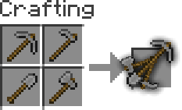
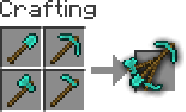

#  **Multitool**

Do you **hate it** when your whole inventory is **cluttered by tools**?

Well, with this data pack you can **combine all the tools** into the **Multitool**.

## **Features**
The Multitool **can always break blocks** meant for the axe, hoe, pickaxe or shovel, no matter what form it is currently in.

If you look at a block, the Multitool **switches to a tool suited for that block** like an axe to strip logs or a shovel to create paths.

When **sneaking** while looking at **tillable blocks**, the Multitool swaps to a **hoe**, so you can create fresh farmland.

You can **enchant** the Multitool!
It supports any enchantment that you can normally put onto a tool.

The Multitool **has 3 times the durability** of a regular tool made from the same material.

Mutlitool even supports **resource packs**, like [this one](https://modrinth.com/resourcepack/dukette-halberds) by [Dukette](https://modrinth.com/user/theDukette), it turns the **Multitool into a halberd**!

## **How to get**

To **craft** a Multitool, you just need to **combine all four types of tools** of the same material in the crafting grid.

## **Adding or removing a Multitool**
You can generate your **own Multitool** data pack simply by **configuring a config** and building it

> This also works for modded tools but note that **some mods break data packs** so I won't guarantee compatability or support

1. Install [Python](https://www.python.org/downloads/) and [beet](https://github.com/mcbeet/beet) 
    _If Python is allready installed, you should just be able to run `pip install beet` to install beet_

2. Clone or download the [GitHub repository](https://github.com/ps-dps/Multitool)

3. Add or remove `materials` in [`multitool_config.yml`](multitool_config.yml) and configure `overwrites`, for mods where a tool isn't following vanilla's naming scheme
    > You can easily find the namespace by looking at the item in your inventory after pressing **F3 + H**, it should be in the form `<namespace>:<material>_<tool>`

4. Move to this folder with a terminal and run `beet`, it should create a folder called `build` with your data pack in it

---

